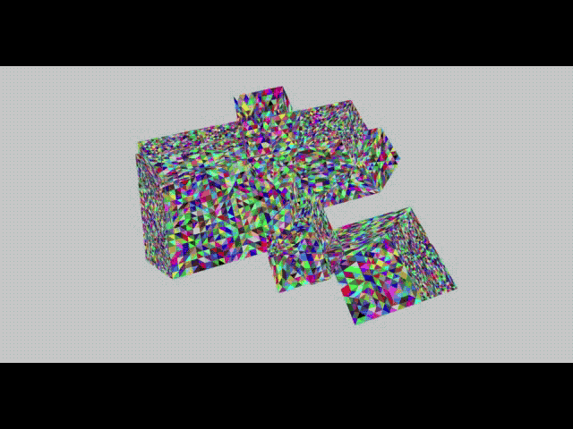

# TM2IN
TM2IN(Triangle Mesh to Indoor data) is a project which converts indoor spatial standard data from raw indoor geometry data, like triangle mesh or point cloud. 
TM2IN not only constructs indoor spatial standard data but also refines geometry data by removing unnecessary elements and reducing the number of surfaces.

The following image is available from [TM2IN-Viewer](https://github.com/cocoslime/TM2IN-Viewer).



## Pipeline


## Author
Dongmin Kim(dongmin.kim@pnu.edu), Pusan National University

## Dependencies

- CGAL (http://www.cgal.org/)
- Eigen3 (http://eigen.tuxfamily.org/index.php?title=Main_Page)
- Boost (http://www.boost.org/)
- rapidxml (http://rapidxml.sourceforge.net) : To read COLLADA(*.dae) file
- libcurl (https://curl.haxx.se/libcurl/c/libcurl.html)
- InFactory (https://github.com/STEMLab/InFactory) : To generate IndoorGML


## Building

Dependencies should be pre-installed in your environment.

```
git clone https://github.com/STEMLab/TM2IN
mkdir build
cd build
cmake ..
make
```

## Usage

```
TM2IN [options] [input_file_name]

```

For example,

```
TM2IN --input-dir=../../input/ --output-dir=../../result --version=0.4.2 inputfile.tvr
```


There are more information about options. (http://github.com/STEMLab/TM2IN/tree/master/doc/usage-manual.md) 

## Development

For Developer, we document source code description. see : [MANUAL](http://STEMLab.github.io/TM2IN/doxygen/index.html)
